# FoxcodePlus
**Visual Studio like extensions to Visual FoxPro IntelliSense.**

Original author: Rodrigo Bruscain

The FoxcodePlus project is designed to bring new IntelliSense features found in Visual Studio to the Visual FoxPro IDE through code written in Visual FoxPro to the Windows API and a FLL. The list of features is quite extensive, **more than 30 new features at least:**

* Incremental IntelliSense for functions, commands, vars, constants and so on.
* Variables at write-time.
* List of variables at write-time.
* Constants at write-time including constants invoked by #INCLUDE MyFile.H
* Tables at write-time and run-time also included tables from DataEnvironment in Forms and Reports.
* Fields at write-time and run-time.
* Selecting a table with the command "Select" or all commands with the clause "IN".
* Windows APIs at write-time and run-time. 
* Functions and Procedures at write-time.
* Classes at write-time.
* Properties at write-time.
* Methods and Events at write-time.
* Support for _MemberData property indicating that the property with the capitalization.
* Summary Tooltip for functions, procedures, methods and events. 
* Classes objects at write-time.
* WITH...ENDWITH with nesting infinity for any class or instantiated object at write-time and run-time. 
* Objects instantiated in memory.
* Incremental Shortcut to controls in Form and Class Designer. 
* Replacement of native IntelliSense in Form and Class Designer.
* New IntelliSense for some commands.
* Code snippets for commands and functions.
* Intellisense at write-time for objects created using the functions CreateObject(),CreateObjectEx() and NewObject() invoking a PRG or VCX file.
* Intellisense for object created by "FOR EACH" at run-time and designer-time
* Intellisense for Collection object at run-time and designer-time 
* Referencing any object through of a variable at run-time and designer-time
* Classes and functions invoked by SET PROCEDURE TO in current program and method or in memory.
* Classes invoked by SET CLASSLIB TO...
* Help pressing F1 when intellisense is opened in current item.
* Documenting properties in PRG files with custom tooltip as a summary.
* Error List window. 
* Error Tip for some run-time erros at write-time. 
* SQL Intellisense for connected database for SELECT, INSERT, UPDATE and DELETE instructions.

## New features FoxcodePlus (Beta 3.13.2)
NEW: SQL Intellisense (inside the TEXT...ENDTEXT block) for connected database. **(Page 24 to 27)**  
**Tested with MS SQL Server.**
a) Support for SELECT, INSERT, UPDATE and DELETE instrunctions
b) Tables with incremental search in current connected database 
c) Table and Alias with incremental searching in currente SQL instruction with the database disconnected
d) Fields with incremental searching in current database connected considering the tables used in currente SQL instruction
e) Fields list from tables and Alias when pressed "." dot	
f) IntelliSense for tables/alias pressing SPACE after the clauses FROM, JOIN and INTO

NEW: Intellisense to the command "INDEX ON" **(Page 18)**  
NEW: Now, objects instatied at run-time show more informations in the tooltip. **(Page 13)**  
NEW: Intellisense for object created by "FOR EACH" at run-time and designer-time. **(Page 22)**  
NEW: Intellisense for Collection object at run-time and designer-time **(Page 22)** 
NEW: Referencing any object through of a variable at run-time and designer-time **(Page 22)**  
NEW: FoxCode table update through the merger between native FoxCode and FoxCode provided by FoxcodePlus. **(Page 34)**  
NEW: SET PROCEDURE TO in memory is also considered. **(Version 3.13.2 - Page 8 and 9)**  

FIX: {"SHIFT+ARROWS, SHIFT+END and SHIFT+HOME behavior not adequate"}  
FIX: "THIS" in containers object in some cases the IntelliSense hasn't load.  
FIX: Several fixes (version 3.13.2)  

**If you already have installed FoxcodePlus 3.10 or a previous version, you must have to replace the files foxcode.app , foxcodeplus.app and whole directory ...\Foxcodeplus\*.*. Also, it’s necessary to do the step 7. If you have installed 3.11 or 3.12 you only have to replace foxcode.app and foxcodeplus.app.**

## FoxcodePlus Images (see all images in documentation)

**New IntelliSense Manager**
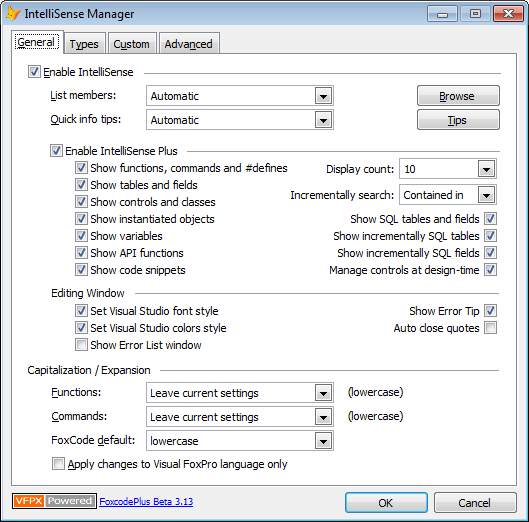

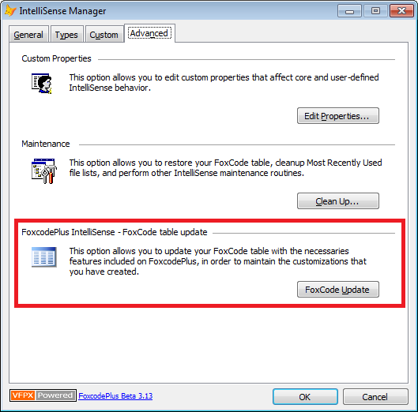

**CreateObject( ), NewObject( ) and CreateObjectEx( )**
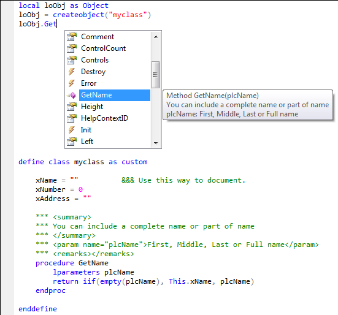

**Incremental Intellisense for Constants in #INCLUDE**
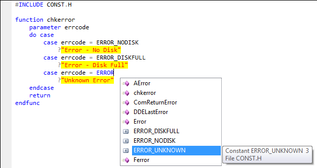

**Signature for custom procedures, functions, methods and events**
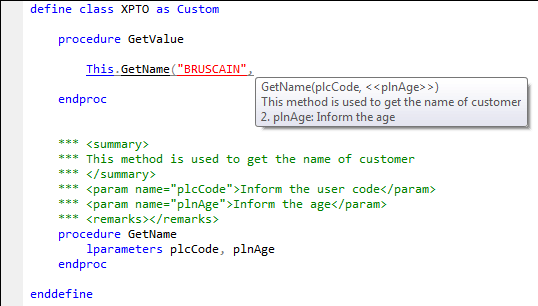

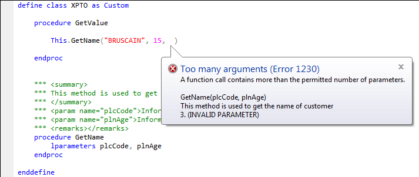

**Classes and functions invoked by SET PROCEDURE TO...**
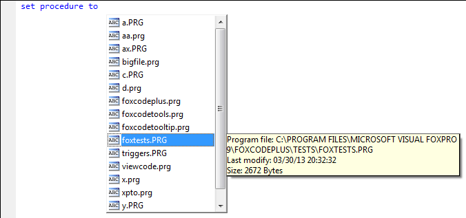

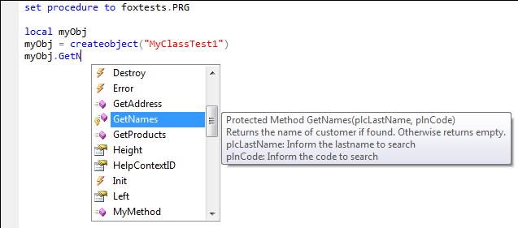

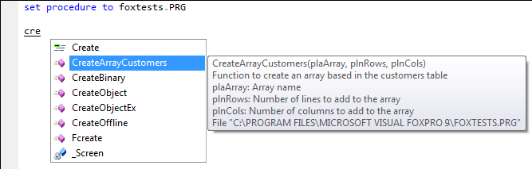

**Classes invoked by SET CLASSLIB TO...**
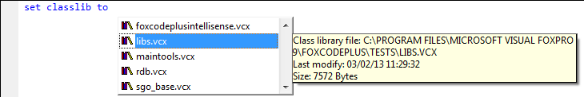

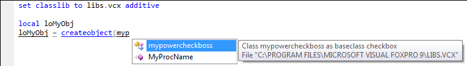

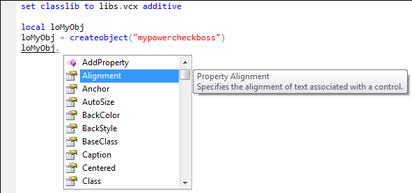

**Error List for Form and Class Designer**
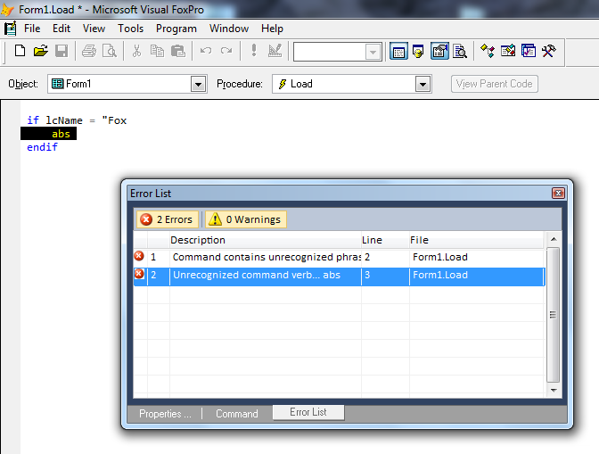

**_MemberData Property**
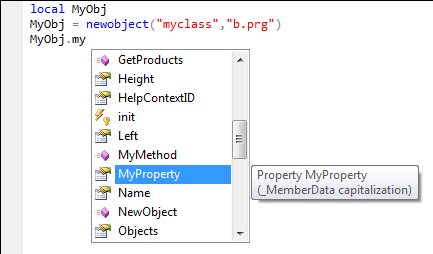

**Error Tip**
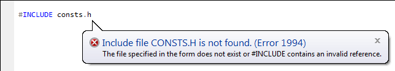

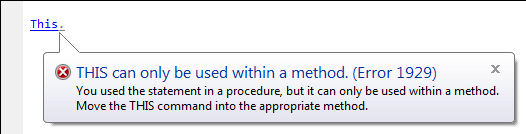

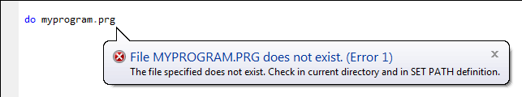

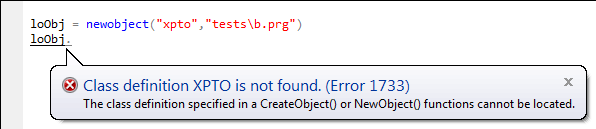

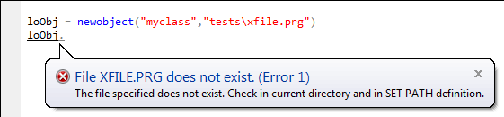

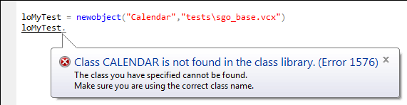

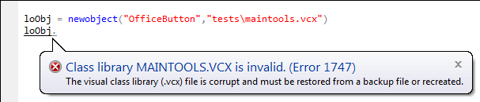

**New Features like in Visual Studio**
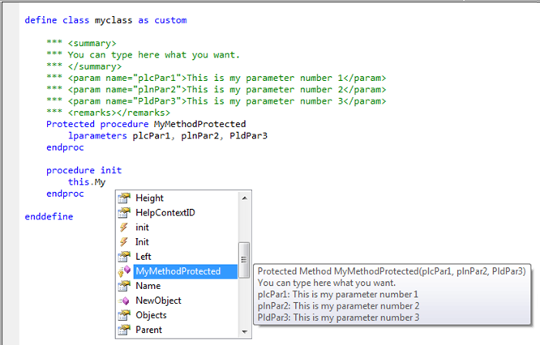

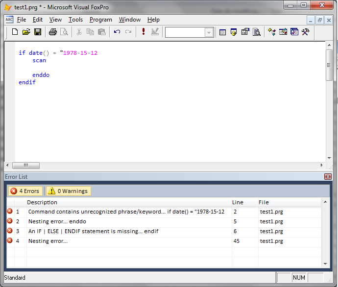

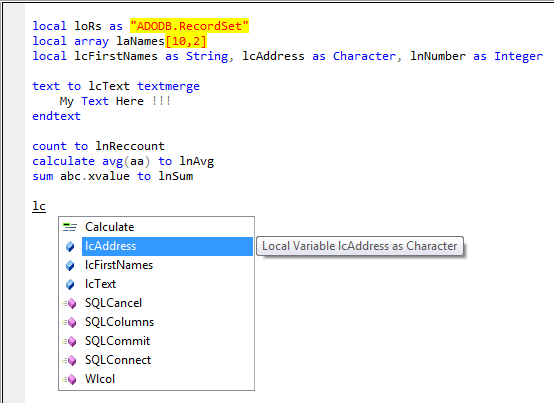

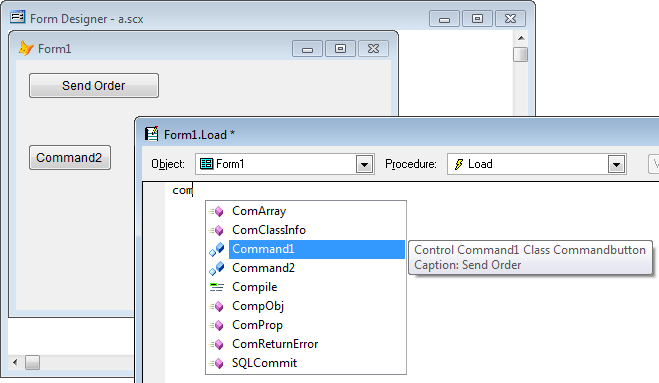

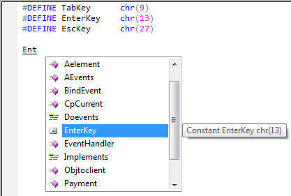

**Tables and fields**
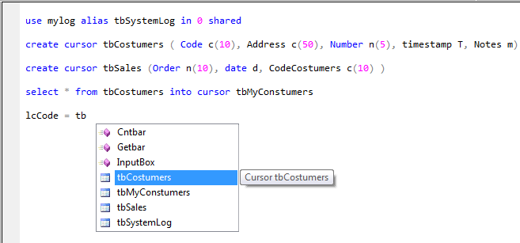

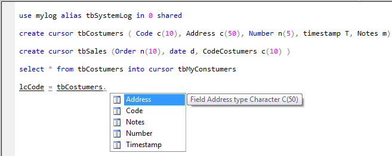

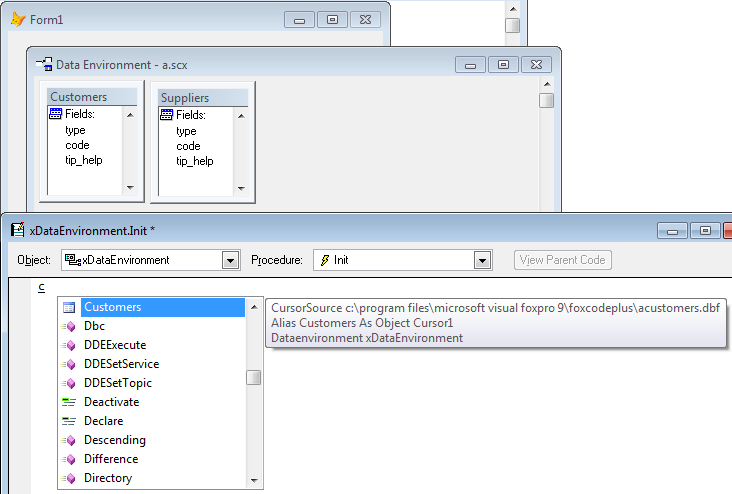

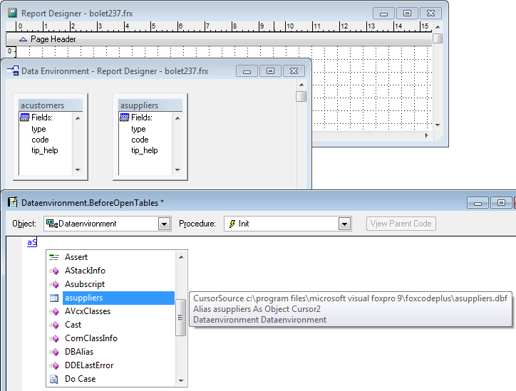

**Objects in memory can be used when VFP is running in background**
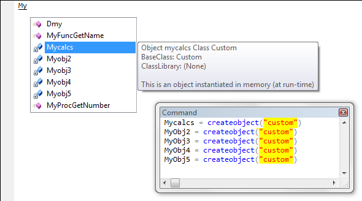

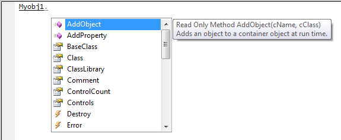

